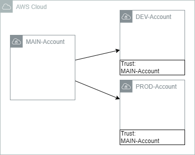

# CDK Account Bootstrapping

## Prerequisites

- Linux based OS
- Task installed (https://taskfile.dev/#/)
- environment variable AWS_ACCOUNT set
- environment variable AWS_PROFILE set

In this section, the cdk bootstrapping is described. It will start with a single account bootstrapping in section [Single Account](#single-account). In section [Multiple Accounts](#multiple-accounts--cross-account-access), the cross staging bootstrapping is described.

## Single Account

To use the cdk bootstrapping tool from AWS, you have to bootstrap your account to create the needed resources like an asset bucket or the cdk roles. The creation will be done automatically if you use the simple bootstrap command:

```shell
cdk bootstrap
```

This command will bootstrap your account and will use the `AdministratorAccess` Policy for the cdk. Sometimes or in a corporate environment, it is needed to reduce the rights for the cdk to give them the least privileges.

If you execute `task bootstrap-main-account`, a task will be executed, which will configure your account with individual rights. You can use the actions.txt file from the scripts folder for the configuration. If you need more rights, you can update the config file and execute it again to update the cdk policy.

## Multiple Accounts / Cross-Account Access

If you work in a corporal environment, or you want to test cross account deployments with a dedicated account i.e. for your pipeline and other resources it's needed to bootstrap more than one account ;)

In this example I will use a main account, where you can place your pipeline, a dev and a prod account for your apps. For your main account, you can use the same functionality as before for a single account bootstrapping. For the other accounts, it's needed to add a trust relationship.



After you updated the stages.json inside the config folder, you can use the following task to bootstrap your accounts with a trust relationship.

```shell
task bootstrap-stage-accounts
```

This task will use the environment variable AWS_ACCOUNT and AWS_PROFILE for your main account and the accounts from the stages.json as your stage accounts.

## References

- https://docs.aws.amazon.com/cdk/v2/guide/home.html
- https://docs.aws.amazon.com/cdk/v2/guide/bootstrapping.html
